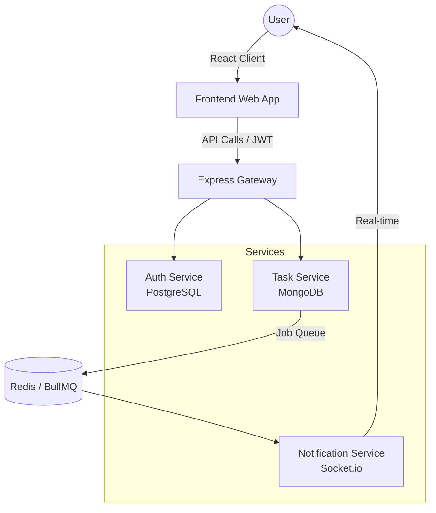

# 🚀 TaskFlow: Enterprise-Grade Task Management System

**TaskFlow** is a robust, high-performance task management application built with a modern MERN stack architecture. Designed for scalability and real-time collaboration, it mirrors the architectural patterns of enterprise tools like Jira, utilizing microservices, message queues, and containerization.

---

## 🛠 Tech Stack

### Frontend
- **Framework**: React 18 with TypeScript
- **Styling**: Tailwind CSS & Lucide Icons
- **State Management**: React Context API
- **Networking**: Axios with interceptors for automatic Token Rotation
- **Animations**: Framer Motion for a premium user experience

### Backend (Microservices Architecture)
- **Auth Service**: Node.js/Express, PostgreSQL, Prisma ORM, JWT (Access/Refresh strategy)
- **Task Service**: Node.js/Express, MongoDB, Mongoose (with Compound Indexing)
- **Notification Service**: Node.js/Express, Socket.io for real-time delivery
- **Communication**: Distributed messaging via **BullMQ** and **Redis**

### Infrastructure & DevOps
- **Containerization**: Docker & Docker Compose
- **Database**: Dual-DB Strategy (PostgreSQL for Auth, MongoDB for Tasks)
- **Caching/Queuing**: Redis
- **Version Control**: Git

---

## ✨ Key Features

- **Microservices Architecture**: Split into three specialized services (Auth, Task, Notification) to allow independent scaling.
- **Real-time Notifications**: Instant alerts when tasks are assigned or updated using WebSockets (Socket.io).
- **Secure Authentication**: Implementation of JWT-based session persistence with Refresh Tokens and automatic re-hydration on page reload.
- **Optimized Data Retrieval**: Compound indexing on MongoDB for lightning-fast filtering by status and user.
- **Asynchronous Processing**: Used BullMQ to handle background notification jobs, ensuring the main task logic remains non-blocking.
- **Cross-Database Integrity**: Manages relational user data (Postgres) alongside flexible document-based task data (MongoDB).

---

## 🏗 System Architecture



---

## 🚦 Getting Started

### Prerequisites
- Docker & Docker Compose
- Node.js (v18+)

### Installation

1. **Clone the repository**
   ```bash
   git clone https://github.com/mika1511/Task-Manager.git
   cd Task-Manager
   ```

2. **Environment Variables**
   Set up `.env` files for each service (examples provided in each directory).

3. **Run with Docker**
   ```bash
   docker-compose up --build
   ```

4. **Access the Application**
   - Frontend: `http://localhost:5173`
   - APIs: `http://localhost:3001` (Auth), `http://localhost:5001` (Tasks)

---

## 🚀 Future Roadmap
- [ ] **TanStack Query**: Implement for advanced server-state management.
- [ ] **Zustand**: Transition global state for better performance.
- [ ] **Aggregated Analytics**: Dashboard insights using MongoDB aggregation pipelines.
- [ ] **Advanced Searching**: Full-text search implementation.

---

## 👤 Author
**[Your Name]**
- LinkedIn: [Your Profile](https://linkedin.com/in/yourprofile)
- Portfolio: [Your Website](https://yourportfolio.com)
