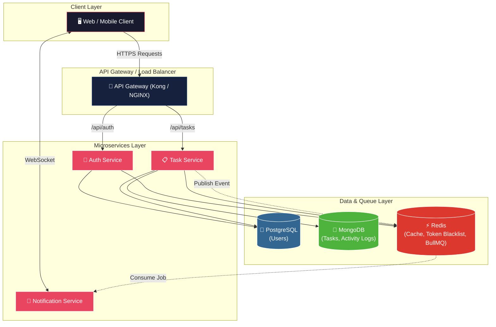
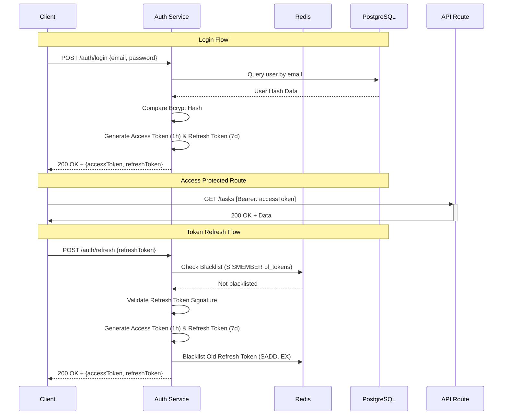
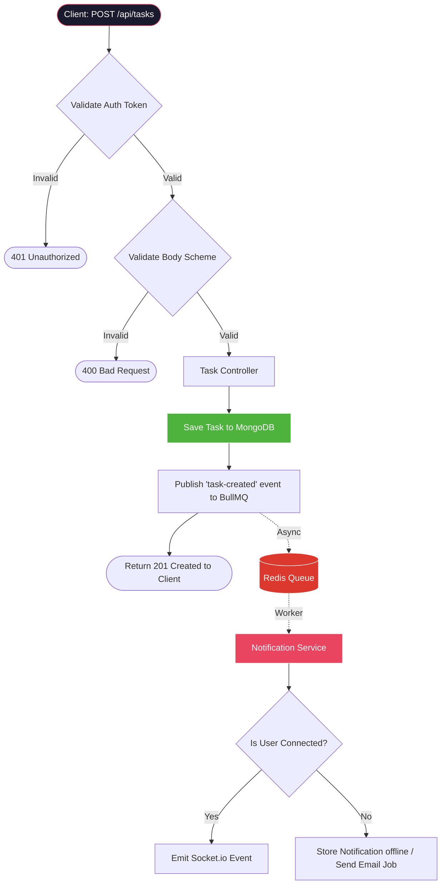
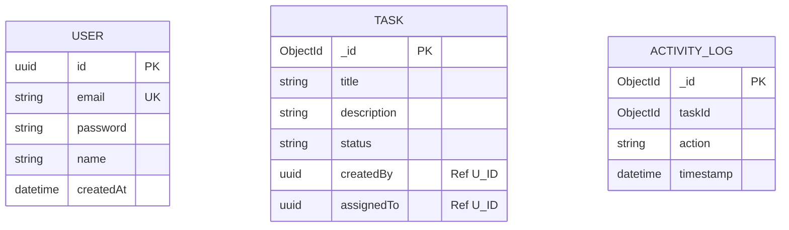

<p align="center">
  
  
  
  
  
  
  
  
  
</p>

<h1 align="center">🚀 TaskFlow API</h1>
<h3 align="center">Enterprise-Grade Task Management Platform — Microservices Architecture</h3>

<p align="center">
  A production-ready, distributed backend system for task management built with <strong>Node.js</strong>, <strong>Express</strong>, and <strong>TypeScript</strong>. Features JWT authentication with refresh token rotation, real-time WebSocket notifications, asynchronous job processing, and a polyglot persistence strategy using PostgreSQL and MongoDB.
</p>

---

## 📋 Table of Contents

- [Project Overview](#1-project-overview)
- [System Architecture](#2-system-architecture)
- [Architecture Diagram](#3-architecture-diagram)
- [Service Breakdown](#4-service-breakdown)
- [Authentication Flow](#5-authentication-flow)
- [Task Creation Flow](#6-task-creation-flow)
- [Database Design](#7-database-design)
- [Folder Structure](#8-folder-structure)
- [Tech Stack](#9-tech-stack)
- [Setup Instructions](#10-setup-instructions)
- [API Documentation](#11-api-documentation)
- [Production Considerations](#12-production-considerations)
- [Future Improvements](#13-future-improvements)

---

## 1. Project Overview

**TaskFlow API** is a robust, multi-tenant backend architecture designed to solve the challenges of collaborative task management across distributed teams. Modeled after enterprise software like Jira, it provides a scalable, resilient foundation for building project management clients.

**Key Problems Solved:**
- **Decoupled Scaling:** By utilizing a microservices architecture, individual components (like Notifications or Auth) can scale independently based on demand.
- **Secure Sessions:** Implementation of stateless JWT authentication combined with Redis-backed refresh token blacklisting ensures secure, instantly revocable user sessions.
- **High-Performance Reads & Writes:** A polyglot persistence model handles relational integrity via PostgreSQL (Prisma) for users, while leveraging MongoDB for flexible, high-throughput task and activity logging.
- **Non-blocking Operations:** Asynchronous task processing using BullMQ (Redis-backed) prevents heavy operations (like notifications) from blocking core API responses.
- **Real-Time Collaboration:** Socket.io guarantees users receive instant updates without polling, reducing server load and improving UX.

---

## 2. System Architecture

TaskFlow utilizes a **microservices architecture** where each service is built independently with its own database access (where applicable) and domain logic. The services communicate predictably through specific channels:

- **Client ↔ API / Gateway:** RESTful HTTPS requests using JSON payloads, secured via JWT Bearer tokens.
- **Inter-service (Async):** Event-driven communication via BullMQ and Redis. Services publish domain events (e.g., `TaskCreated`) to queues consumed by downstream services.
- **Server ↔ Client (Real-time):** WebSocket connections (via Socket.io) for pushing asynchronous job results or collaborative updates directly to the connected clients.

The polyglot persistence layer directs strict schema data (Users, Projects) to **PostgreSQL** to maintain ACID parity, and flexible/high-volume data (Tasks, Activity Logs) to **MongoDB**. **Redis** operates as a high-speed cache for queries and handles the token blacklist logic.

---

## 3. Architecture Diagram



---

## 4. Service Breakdown

### 🔐 1. Auth Service
**Responsibility:** Identity management, authentication, and session control.
- **Main Endpoints:**
  - `POST /api/auth/register`
  - `POST /api/auth/login`
  - `POST /api/auth/refresh`
  - `POST /api/auth/logout`
- **Internal Logic:** Handles bcrypt password hashing. Generates short-lived Access Tokens and long-lived Refresh Tokens. Refresh tokens are tracked and revoked via Redis sets to securely handle session termination (logout) and prevent token replay.

### 📋 2. Task Service
**Responsibility:** Task creation, board management, state transitions, and activity logging.
- **Main Endpoints:**
  - `POST /api/tasks`
  - `GET /api/tasks` (with filtering, pagination & Redis caching)
  - `PATCH /api/tasks/:id`
  - `DELETE /api/tasks/:id`
- **Internal Logic:** Creates task documents in MongoDB referencing PostgreSQL IDs. Implements caching around `GET` requests with a 60-second TTL to reduce DB hits. Upon task mutations (Create/Update), pushes a background job to the Redis/BullMQ queue.

### 🔔 3. Notification Service
**Responsibility:** Asynchronous queue consumption and real-time client communication.
- **Main Endpoints / Handlers:**
  - BullMQ Worker consuming `task-created` and `task-updated`
  - WebSocket Server (Socket.io hookups)
- **Internal Logic:** Listens strictly to Redis for queued jobs. When a job is processed, it emits asynchronous WebSocket events to connected specific clients/rooms dynamically (e.g. "You've been assigned a task", or simulated email logs).

---

## 5. Authentication Flow



---

## 6. Task Creation Flow



---

## 7. Database Design



---

## 8. Folder Structure

```text
MERN Stack/
├── client/                           # React + Vite Client Application
│   └── assign-me-now/ 
│       ├── src/
│       │   ├── components/           # Reusable UI widgets
│       │   ├── context/              # Context API state stores
│       │   ├── hooks/                # Custom hooks
│       │   ├── lib/                  # Axios definitions & utilities
│       │   └── pages/                # App views
│
├── taskflow-api/                     # Microservices Root
│   ├── docker-compose.yml            # Container orchestration manifest
│   ├── PROJECT_CONTEXT.md            # Architecture decision records
│   ├── services/
│   │   ├── auth-service/             # Port 3001 | Auth, Users, Redis logic
│   │   │   ├── prisma/               # PostgreSQL schema & migrations
│   │   │   └── src/                  # Controllers, Middleware, Routes
│   │   │
│   │   ├── task-service/             # Port 3003 | MongoDB mapping, Task Queue Publisher
│   │   │
│   │   └── notification-service/     # Port 3004 | BullMQ worker & WebSockets
│   │
│   └── shared/                       # Common types, enum schemas
```

---

## 9. Tech Stack

| Category | Technology | Purpose |
| :--- | :--- | :--- |
| **Runtime** | `Node.js` | Fast, asynchronous JavaScript runtime backend. |
| **Framework** | `Express.js` | Minimalistic REST API routing and middleware. |
| **Language** | `TypeScript` | Strict typing, improved intellisense and developer safety. |
| **Relational ORM** | `Prisma` | Type-safe queries and migration management. |
| **Relational DB** | `PostgreSQL` | High-integrity data storage for Users, Projects. |
| **NoSQL ODM & DB** | `Mongoose` & `MongoDB`| Flexible schemas and logs structure for high-write loads. |
| **Cache & State** | `Redis` | Token blacklisting, fast payload caching, job broker. |
| **Message Queue** | `Bull Queue` | Guaranteed asynchronous job processing. |
| **Containerization**| `Docker Compose`| Reproducible local environment scaffolding. |
| **Real-time** | `Socket.io` | Bi-directional communication for pushing UI updates. |

---

## 10. Setup Instructions

### Environment Prerequisites
- **Node.js**: v18 or newer
- **Docker**: Docker Engine and Docker Compose

### 1) Clone repository
```bash
git clone https://github.com/mika1511/Task-Manager.git
cd Task-Manager/taskflow-api
```

### 2) Run Infrastructure Containers
Spin up PostgreSQL, MongoDB, and Redis locally.
```bash
docker-compose up -d
```

### 3) Set Up Environment Variables
Create `.env` inside each target service directory:

**`services/auth-service/.env`**
```env
PORT=3001
DATABASE_URL="postgresql://<USER>:<PASSWORD>@localhost:5433/taskflow"
JWT_SECRET="<YOUR_JWT_SECRET>"
ACCESS_TOKEN_EXPIRY=1h
REFRESH_TOKEN_EXPIRY=7d
REDIS_HOST=127.0.0.1
REDIS_PORT=6379
```

**`services/task-service/.env`**
```env
PORT=3003
MONGO_URI="mongodb://localhost:27017/taskflow"
JWT_SECRET="<YOUR_JWT_SECRET>"
REDIS_HOST=127.0.0.1
REDIS_PORT=6379
```

### 4) Install Dependencies and Run Migrations
```bash
# In auth-service:
cd services/auth-service
npm install
npx prisma migrate dev --name init
npm run dev

# In another terminal for task-service:
cd services/task-service
npm install
npm run dev

# In another terminal for notification-service:
cd services/notification-service
npm install
npm run dev
```

---

## 11. API Documentation

### Auth Service (Port 3001)
- `POST /api/auth/register` - Register a user and hash password.
- `POST /api/auth/login` - Exchange credentials for Access/Refresh tokens.
- `POST /api/auth/refresh` - Swap a valid refresh token for a new set.
- `POST /api/auth/logout` - Revoke current refresh token in Redis.

### Task Service (Port 3003)
- `POST /api/tasks` - Create a task in MongoDB and emit Bull Queue job.
- `GET /api/tasks` - Fetch tasks, checks Redis Cache first (60s TTL).
- `PATCH /api/tasks/:id` - Re-assign task or change status (Pending -> In Progress).
- `DELETE /api/tasks/:id` - Delete a specific task.

---

## 12. Production Considerations

1. **Scalability:** 
   - Microservices allow instance spin-ups behind a load balancer (e.g. AWS ALB or Kong Gateway) specifically for heavy services like the `task-service`.
2. **Caching:** 
   - Strict Redis lookup on the `GET /tasks` listing significantly minimizes MongoDB load, with cache invalidation emitted on task mutate events.
3. **Queue Resilience:** 
   - BullMQ protects standard REST APIs from hanging. Email or push notification failures are contained within the `notification-service` without user impact. Retry logic natively handles intermittent SMTP/Network falters.
4. **Security:** 
   - Using Redis for token blacklisting ensures hijacked refresh tokens can be immediately voided globally. Prisma protects against SQL injection. `bcrypt` prevents credential exposure.

---

## 13. Future Improvements

As development continues, prioritizing the following components will harden the system further:
- **API Gateway:** Implement Kong or NGINX to handle single-entry routing, header standardization, rate-limiting, and SSL termination.
- **Service Discovery:** Introduce Consul or etcd to route internal traffic rather than hardcoding mapped ports.
- **Rate Limiting:** Protect public endpoints like `/login` via Redis tracking buckets (e.g. Redis sliding windows).
- **Message Brokers:** Migrate from Redis generic queues to a heavy-duty broker like RabbitMQ or Apache Kafka to permit complex service fan-outs.
- **CI / CD Integrations:** Centralized GitHub Actions to build isolated Docker images and automated integration testing pre-merge.
- **Observability:** Centralize service logs into an ELK stack / Datadog or emit OpenTelemetry traces.

---

## 👤 Author

**Bhumika Deshmukh**

Built as a portfolio project demonstrating production-grade backend engineering with microservices architecture, distributed messaging, and real-time systems.

---

<p align="center">
  <strong>⭐ If this project demonstrates solid backend engineering, consider giving it a star!</strong>
</p>
